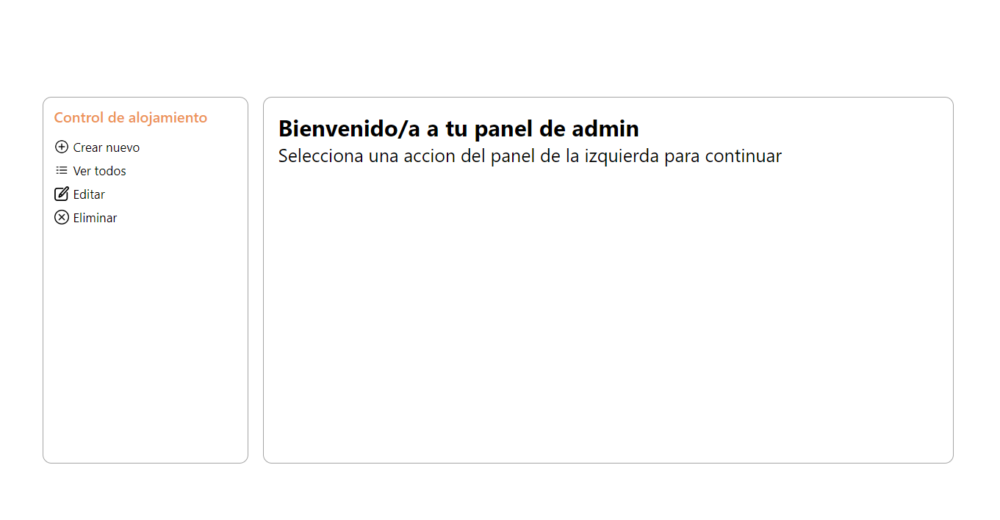
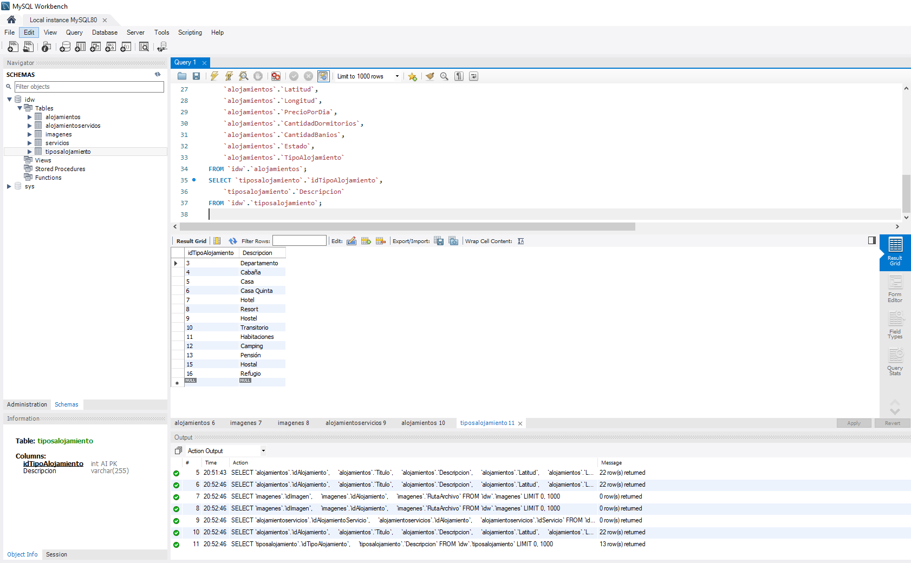

# Trabajo Final Integrador - UNER

## Integrantes:

- Francisco Daniel Molina - https://github.com/fmolinadev
- Sebastián Exequiel Duarte - https://github.com/SebastianDte
- Lucas Miguel Díaz - https://github.com/lmd-git

En esta segunda entrega del final Integrador de IDW se requeria:

- Migrar a ReactJS las páginas programadas en la etapa anterior: inicial o portada, página con información de contacto y página con información institucional.
- Utilizando ReactRouter deberá aplicar navegación entre las mismas.
- Crear una nueva página de administración que permita para las entidades Alojamiento Tipo: Listar, Crear, Editar y Eliminar registros a través de la interacción con la API Rest suministrada por la cátedra.

# Iniciamos el proyecto con Create React App

[Create React App](https://github.com/facebook/create-react-app).

# Otras tecnologías usadas:

- React Router Dom -> Para la navegación
- Axios -> Para realizar las solicitudes HTTP
- Sweet Alert 2 -> Mostrar alertas que no san las nativas del navegador
- CSS Modules -> Para implementar CSS
- PropTypes -> Para tipar parametros que requerian componentes sensibles

## Para levantar el proyecto

En el directorio base "./" hacemos:

### `npm i`

### `npm run start`

Luego abrimos el puerto 3000 donde vemos el proyecto [http://localhost:3000](http://localhost:3000).

## Capturas de pantalla del proyecto:

- Vista Home:

Renderizamos los resultados de la Base de Datos. Cuenta con un filtro para realizar búsquedas más especificas.

- Vista Contacto:

El formulario cuenta con validaciones para el email ingresado. Solo permite accionar el boton de enviar cuando esten todos los datos requeridos.

- Vista de Informacion Institucional:

Mostramos informacion de "BookingIDW", su mision, valores, historia.

- Vista de Admin:

En esta incorporacion contamos con una vista de Login de admins

Al ingresar hay un mensaje por defecto:

Seleccion de crear:
Aqui conttamos con validaciones sobre el nuevo tipo. Solo se puede crear si no existe.

Seleccion de listar:
Se visualiza una lista con todos los Tipos de Alojamientos creados

Seleccion de Editar:
Se valida que el nuevo tipo a crear no exista en la Base de Datos

Seleccion de Eliminar:
Para eliminar un Tipo de Alojamiento se solicita una re-confirmación de la accion.

## Sobre la API:

Realizamos la conexion y ejecutamos los scrips asignados,  creamos datos para poblar las tablas:

Creamos nuestras variables de entorno y realizamos la conexion a la Base de Datos. Ejm:

Creamos las tablas:

Montamos los endpoints detallados en el Repositorio de la API para hacer pruebas en Insomnia:

Luego de esto, comenzamos a desarrollar los componentes de React.

## Puntos de mejora:
- Hacer un paginado en la Home
- Simular un proceso de Reserva
- Mostrar pantalla de "Error" y "Cargando" con diseños aptos a la propuesta de diseño
- Persistir el Login del Admin y poder "Cerrar Sesión" si asi lo deseara
- Mostrar imagen en cada Alojamiento: Por el momento contamos con Placeholder
- Mostrar más informacion del Admin que accedio. Es decir, crear esos usuarios para validarlos
